# 👋 Hi, I'm Shantanu Shaw

💻 BCA student specializing in **AI & Deep Learning**  
🚀 Exploring **AI/ML, Full-Stack Development, Cloud & Mobile Development**

  

---

## 🌐 Connect With Me

---

# 💻 Tech Stack

## 👨‍💻 Programming Languages

## 🌐 Web & Application Development

## ⚙️ Backend & APIs

## 🗄️ Databases & Backend Services

## ☁️ Cloud & Infrastructure

## 🛠️ Tools & Platforms

## 🎮 Gaming & Graphics

---

# 📊 GitHub Stats

---

# 👀 Profile Views

---

# 🐍 My Contribution Snake

<picture>
  <source
    media="(prefers-color-scheme: dark)"
    srcset="https://raw.githubusercontent.com/Shantanu-tech882/Shantanu-tech882/output/github-snake-dark.svg"
  />
  <source
    media="(prefers-color-scheme: light)"
    srcset="https://raw.githubusercontent.com/Shantanu-tech882/Shantanu-tech882/output/github-snake.svg"
  />
  
</picture>

---

⭐ Thanks for visiting my profile!
